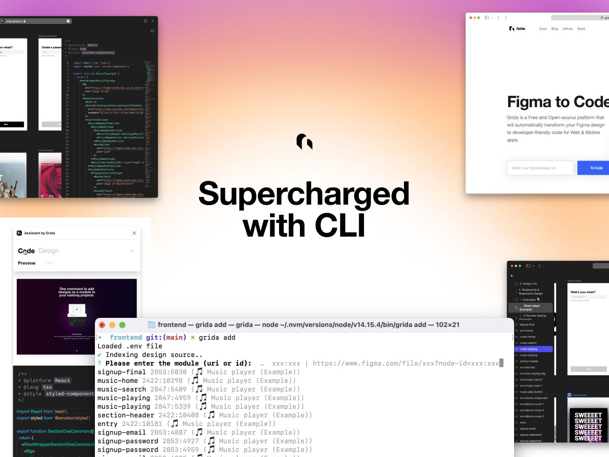

# CLI



Grida CLI 는 디자인을 마치 모듈처럼 관리할수 있도록 도와주는 일종의 패키지 매니저 입니다. 간단히는 디자인 모듈을 임포트하여 프로젝트에 사용하거나, 응용으로는 디자인을 바탕으로 CI/CD 파이프라인을 구축할수도 있습니다.

## Install CLI

```
npm i -g grida
```

> Note: It is recommended to install Griad CLI inside a project (instead of globally) - `yarn add --dev grida` or `npm i --save-dev grida`.

## `grida init`

Fisrt, you need to initialize your project with `grida init`.
grida init works for both empty project and for existing project.

If you don't have a existing node project (react, rn, svelte, ...) (with package.json) or dart/flutter project (with pubspec.yaml), grida will prompt you to create a new project.

**Starting from scratch (no existing project)**

You'll get the message below if you run grida init under empty directory with no project root.

```

\$ grida init

> No project root is found (package.json or pubspec.yml) with framework configuration. Do you want to continue without creating a project? (y/N)

```

- No (default) - grida will walk you through to create a new base project.
- Yes - grida ignores the base project and continues with the initialization. (this make break the configuration afterwards. not recommanded)

### 1. Design source configuration

Once init is complete, you'll be prompted to configure the design source like below.

```
> Where from to import your design? : figma
> Please enter your figma file url : https://www.figma.com/file/xxx
> Please enter your figma personal access token.: ******************
```

- origin : The provider of your design (figma, sketch, ...)
- file : The unique identifier or file path to your design.
- token (for figma) : A [personal-access-token](../with-figma/guides/how-to-get-personal-access-token) for grida cli to read your design (readonly).

### 2. Framework configuration

Once the design source configuration is complete, you'll be prompt to configure settings for your framework.
The promps & specs vary by frameworks, you can see each configurations at [`@grida/builder-config`](https://github.com/gridaco/code/tree/main/packages/builder-config).

You may follow the cli prompts to configure your project. You can edit this manually in grida.config.js once the init process is complete.

**React example of framework config**

```js
/**
 * @type {import('@grida/builder-config').FrameworkConfig}
 */
const frameworkConfig = {
  framework: "react",
  language: "tsx",
  component_declaration_style: {
    exporting_style: {
      type: "export-named-functional-component",
      declaration_syntax_choice: "function",
      exporting_position: "with-declaration",
    },
  },
};
```

### Project structure

Once project setup is complete, you'll see you project tree organized like below.

**For example, NextJS**

```
...
├── .grida             (created)
├── .env               (modified)
├── .gitignore         (modified)
├── README.md
├── grida              (created)
│   └── .gitkeep       (created)
├── grida.config.js    (created)
├── next-env.d.ts
├── package.json       (modified)
├── pages
│   ├── _app.tsx
│   └── index.tsx
├── public
├── styles
├── tsconfig.json
└── ...
```

**For example, Flutter**

```
...
├── .grida                   (created)
├── .env                     (modified)
├── .gitignore               (modified)
├── README.md
├── analysis_options.yaml
├── build
├── flutter_app.iml
├── grida.config.js
├── lib
│   ├── grida                (created)
│   │   └── .gitkeep
│   └── main.dart
├── pubspec.lock
├── pubspec.yaml
├── test
│   └── widget_test.dart
├── web
├── macos
├── ios
├── landroid
├── linux
├── windows
└── ...
```

## `grida add`

grida works like a package manager that you might already be familiar with. The syntax is,

```
grida add [modules...]
# use project configuration
grida add
# add specific design module
grida add <modules...>
```

**Running `grida add` without arguments**

Running `grida add` without any arguments will prompt you to select a design module to add. This is automatically managed by grida cli. but this is not recommended since idendifying your design with its name may cause human errors.

**Adding package**

> `grida add <module>`

**Adding package with figma url**

You can import target design with, `grida add <figma-url>`.

> If the givven figma url points to entire file or a page, You might be importing tons of modules at one time. It is recommended to use frame-level url instead.

```bash
$ grida add https://www.figma.com/file/x7RRK6RwWtZuNakmbMLTVH/examples?node-id=2422%3A10181

# or you can add with id only (the target should be a node that is inside the file you have in grida.config.js)

$ grida add 2422:10181
```

The added package will be added to `/grida` or `/lib/grida` (for flutter) by default, unless you have additional configuration.

You are now good to go with your main working file, and import the added module.

So for example (react), In your `pages/index.tsx`, you may import like..

```tsx
import { NewModuleFromFigma } from "../grida/new-module-from-figma";

export default function() {
  return (
    <>
      {/* ... */}
      <NewModuleFromFigma />
      {/* ... */}
    </>
  );
}
```

## See also

- [(ko) Grida CLI @ disquiet.io](https://disquiet.io/product/figma-cli-by-grida)
