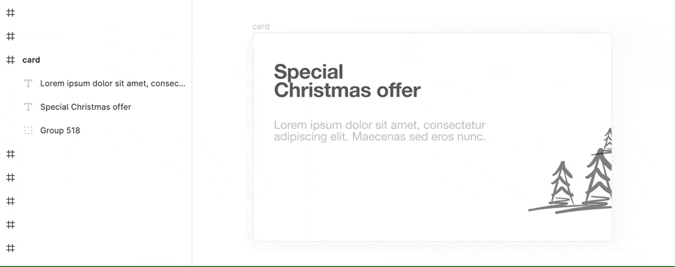

# Flags

Flags are a way to define a set of options that can be used to customize the behavior of a component.

Flags are great way of extending your design as more life-like and responsive.

## How to use flags

**Example case 1. - I want my group to be exported as artwork.**



Like in the example above, the `--artwork` flag is used to export the group as an artwork.

```tsx
// conceptually, this converts this
<div>
  
  
  
</div>

// to this

```

Learn more about [--artwork](../@designto-code/flags/--artwork)

<!-- this link is valid on docs site -->

**Example case 2. - I want my text to be rendered as `<h1>`.**


